# Lab 2 - Data Acquasition, Storage and Display
## CSCE 436 - Advanced Embedded Systems
## By Brandon Ramos

## Table of Contents (not required but makes things easy to read)
1. [Objectives or Purpose](#objectives-or-purpose)
2. [Preliminary Design](#preliminary-design)
 * [Code](#code)
3. [Software flow chart or algorithms](#software-flow-chart-or-algorithms)
 * [Pseudocode](#pseudocode)
4. [Hardware schematic](#hardware-schematic)
5. [Well-formatted code](#well-formatted-code)
6. [Debugging](#debugging)
7. [Testing methodology or results](#testing-methodology-or-results)
8. [Answers to Lab Questions](#answers-to-lab-questions)
9. [Observations and Conclusions](#observations-and-conclusions)
10. [Documentation](#documentation)
 
### Objectives or Purpose 
In this lab, we will integrate the video display controller developed in Lab 1 with the audio codec 
on the Nexys Video board to build a basic 2-channel oscilloscope. When complete, the lab should 
generate an output similar to the picture below.

##### Overview of Lab 2
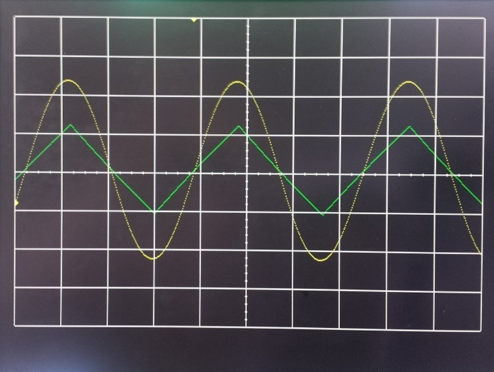

This lab is built on top of the previous lab with VGA Synchronization where we build the scopeface
and triggermarks. Later in this document, you will see the physical I/O used for the data and the
architecture of the lab. 

### Preliminary design

#### Architecture of Lab 2
Just like the design of Lab 1, Lab 2 is broken down into a bunch of separate modules, shown in the 
block diagram below. Some of the components in the block diagram will be given and others 
created in Lab 1. It is important to note that some of the components and signals associated with 
this diagram will not be needed for Lab 2, but have been included because you will need them in 
Labs 3 and 4.

##### Architecture
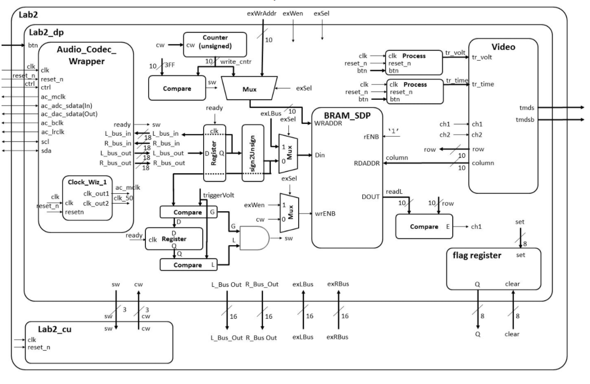

Consider the data in the diagram as flowing from left to Right. There will be an input signal to 
the Nexys board via a 3.5mm cable connected to the blue line-in jack (shown in hardware). This signal 
then passes through an Analog Devices ADAU1761 SigmaDSP Audio Codec. The ADAU1761 samples the audio 
input at 48kHz into separate 18-bit 2's complement left and right channels. The ADAU1761 then 
transfers this data to our Artix 7 chip over a serial bus through the 7 signals on the left side of 
the Lab2 component. More information about the audio codec on page 27 of the Nexys Video manual,
there will be a link to the Manual in the Documentation.

The serial protocol coming from the audio codec is quite complex, so given will be the Audio Codec 
Wrapper component as an interface to extract the incoming signal (Audio Codec Wrapper in the Figure above). 
Whenever new converted data is ready from the Audio Codec, the ready signal will go high for a single clock 
cycle. The circuit will then do two things with the incoming L_bus_out and R_bus_out signals: First, 
it will loop both of these signals back into the Audio Codec so that we can verify (by listening on 
the green line-out jack) that the Audio Codec hardware and firmware are operating correctly. This is 
accomplished using the VHDL code below.

##### VHDL code for audio loopback

	-- Audio Code Loopback Process:
   	 process (clk)
    	begin
		if (rising_edge(clk)) then
	    	if reset_n = '0' then
			L_bus_in <= (others => '0');
			R_bus_in <= (others => '0');				
	  	  elsif(ready = '1') then
			L_bus_in <= L_bus_out;
			R_bus_in <= R_bus_out;
	   	 end if;
		end if;
   	 end process;

Second, the circuit will need to send the L_bus_out and R_bus_out signals in an unsigned format to be stored 
in the block ram (BRAM). To do this, we will need to convert the 2's complement values to unsigned. Performing 
this conversion is technically easy, so let's do some examples. Consider the table below

##### I/O values for audio bus
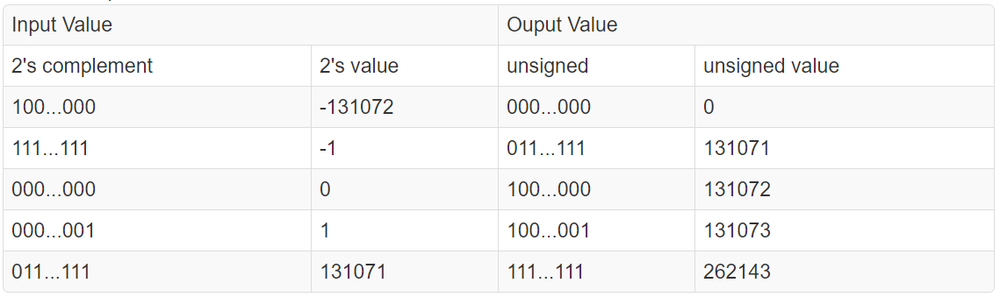

The values in the left 2 columns represent the 2's complement number coming out of the Audio Codec, in this case 
L_bus_out, while the right 2 columns represent the output of the box labeled "sign2unsign" in the block diagram. 
What we are essentially doing is shifting the unsigned values up by 131072 (the value which will make all 18-bit 
numbers positive) so that they all fall into a positive range.

Here are a couple more pieces of info to help understand the block diagram above. Consider the mux with its 
input going to the WRADDR input of the "BRAM_SDP" block in the block diagram. This mux circuitry attached to the 
write address of the BRAM will be used in Lab3, allowing the microBlaze processor to take over write duties for 
the RAM (as opposed to an external signal from the Audio Codec). Independent of the write circuitry, the read 
circuit pulls data from the RAM, and draws the waveform. Unlike for the write circuitry, the read circuitry 
requires no FSM control.

##### Datapath
Since its a very complex piece of circuitry, the entity for the datapath (LAB2_DP in the block diagram) is given 
below.

	entity lab2_datapath is
		Port(
		clk : in  STD_LOGIC;
		reset_n : in  STD_LOGIC;
		ac_mclk : out STD_LOGIC;
		ac_adc_sdata : in STD_LOGIC;
		ac_dac_sdata : out STD_LOGIC;
		ac_bclk : out STD_LOGIC;
		ac_lrclk : out STD_LOGIC;
		scl : inout STD_LOGIC;
		sda : inout STD_LOGIC;	
		tmds : out  STD_LOGIC_VECTOR (3 downto 0);
		tmdsb : out  STD_LOGIC_VECTOR (3 downto 0);
		sw: out std_logic_vector(2 downto 0);
		cw: in std_logic_vector (2 downto 0);
		btn: in	STD_LOGIC_VECTOR(4 downto 0);
		exWrAddr: in std_logic_vector(9 downto 0);
		exWen, exSel: in std_logic;
		Lbus_out, Rbus_out: out std_logic_vector(15 downto 0);
		exLbus, exRbus: in std_logic_vector(15 downto 0);
		flagQ: out std_logic_vector(7 downto 0);
		flagClear: in std_logic_vector(7 downto 0));
	end lab2_datapath;
	

##### Flag Register
In Lab 3, we will be integrating most of the components from this lab with the MicroBlaze processor (a processor 
we program onto our FPGA). In order to make this smooth, we will need a way to transfer information between the 
two systems a technique similar to a 2-line handshake. To make this possible, you will need to build a component 
called a flag register. The behavior of the flag register is shown in the table below.

##### Control for Flag Register
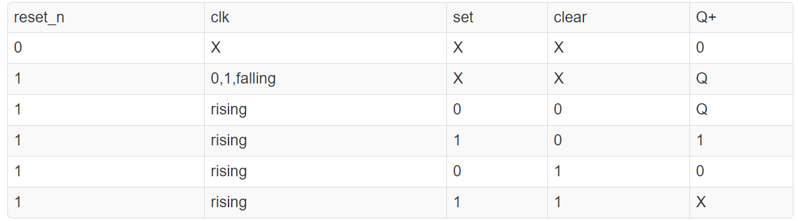

The flag register will interface our lab2 component with a MicroBlaze as follows: The LAB2 component will produce 
some data, put it on a data line to the MicroBlaze, and then set one of the bits of the flag register. Then, the 
MicroBlaze will, at some point, look at the flag register bit. When it sees that the 'set' bit is 1, the MicroBlaze 
will grab the data from the register and clear the set bit. These are just like the flag bits on the MSP 430. 
Use the following entity declaration for the flag register:

##### Flag Register VHDL
	entity flagRegister is
		Generic (N: integer := 8);
		Port(	clk: in  STD_LOGIC;
				reset_n : in  STD_LOGIC;
				set, clear: in std_logic_vector(N-1 downto 0);
				Q: out std_logic_vector(N-1 downto 0));
	end flagRegister
	
The set lines should be connected to the signals below. For the time being, you can leave the Q outputs to open.
-ready    
-v_synch  
-write_cnt compare output   

#### BRAM
We need to map the ports of BRAM to include it in the lab2_datapath. The component is declared in the UNIMACRO
library - look at that library to figure out how to port map BRAM.

##### Header Library
	library UNIMACRO;		-- This contains links to the Xilinx block RAM
	use UNIMACRO.vcomponents.all;
	
#### Generating Audio Waveforms
Since we need to use a 3.5mm jack to input signals to the Nexys board, a phone's audio output works quite well. 
However, make sure you get an app where you can control both the left and right audio channels individually 
(i.e. the green and yellow signals in the overview figure).

#### Gate Checks for Required Functionality
There are 2 gate checks associated with this lab, each worth 5 points.

#### Gate Check 1
By COB Lesson 14, we must have started a Lab 2 Vivado project and downloaded the template files and drop in the
Video, VGA, Scopeface, dvid, and tdms files from Lab 1 into Lab 2 project in order to test Lab 1 Scopeface works
when implemented the Audio Code Wrapper. Notice from the block diagram... we will copy your Video instantiation 
and button processes from Lab 1 into Lab 2 Datapath. We will also have to re-implement the Lab 1 Clocking Wizard 
in the Lab 2 project. Doing this will eliminate a lot of errors from un-driven output signals on lab 2 top.

Next, we will need to have implement another Clocking Wizard and the Audio Codec Wrapper inside the Datapath entity 
to get the Audio Codec to begin functioning. Once we fully implement the Audio Codec Wrapper, we will drop in the 
Loopback process and make connections to loopback the serial ADC input back out to the DAC output 
(i.e. send the signal back into the Codec). Once we implement the design on the board, we can verify functionality 
by applying an audio signal to the audio line in jack (blue) and listening to it on the audio line out jack 
(Green) using a standard oscilloscope. Additionally the Scopeface and Button inputs from Lab 1 should be functional 
as well.

In the documentation section, there will be a VidGrid video of the gate check. This includes the scopeface and the
audio codec loopback process that can be heard through a 3.5mm audio jack output. 

#### Gate Check 2
By BOC Lesson 16, we must have implemented and connected the left channel BRAM and BRAM Address Counter to write 
Audio Codec data to BRAM. Once implemented, we can verify the BRAM works by using the given datapath testbench 
and watching the BRAM write address increment and data be written/read from the BRAM.
Once this is working, we must implement Video entity (from Lab 1) to take the left channel output from BRAM and 
send it to the Channel 1 waveform to be displayed when the readL value equals the row value. Once implemented, 
this functionality can be verified first with the given datapath testbench to verify the channel 1 values are being 
updated properly when readL equals the row value. Additionally, we may try to implement this on the hardware and 
verify that your scopeface is still present and some values are being displayed for Channel 1 (at this point the 
waveform will be scrolling across the display or may be scaled wrong).

Below can be seen the BRAM waveform that shows the unsigned 18 bit value going in and out. The second image is the 
screenshot of the scopeface where the scrolling of ch1 across the grid. This is due to not setting the trigger and 
Finite State Machine States. 

##### BRAM Values (WRADDR and ReadL) Waveform
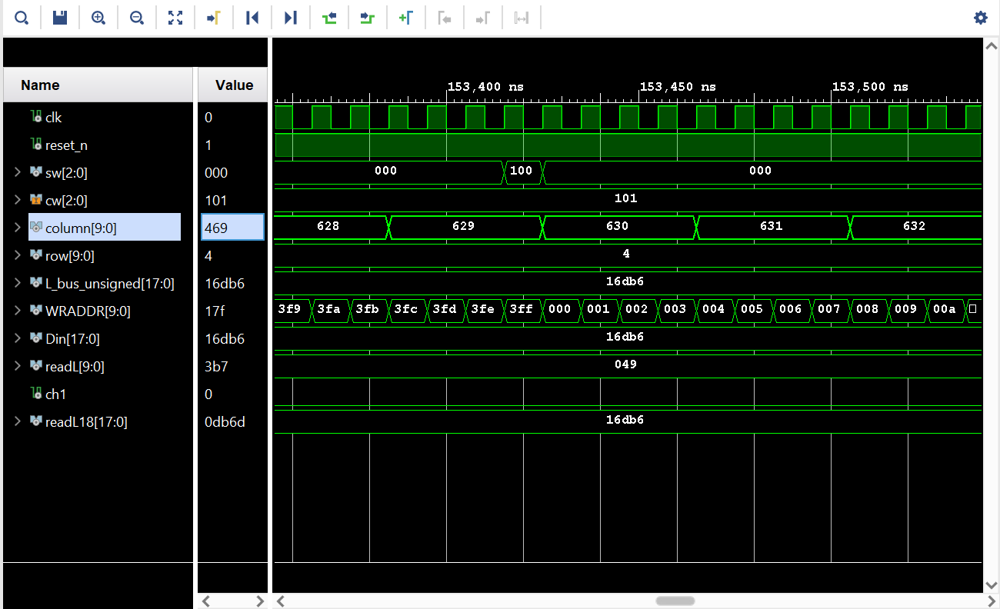

##### Scrolling of ch1
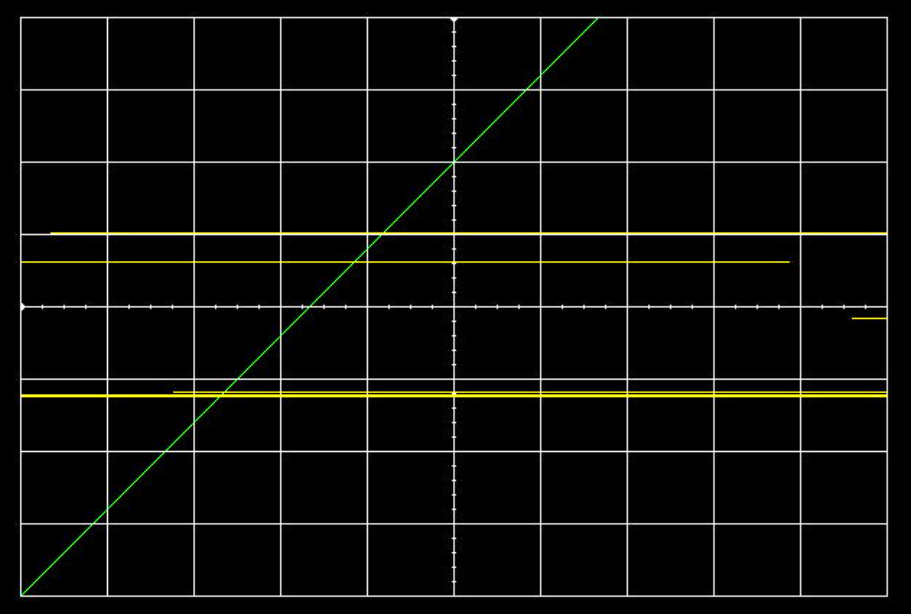

#### Required Functionality
Get a single channel of the oscilloscope to display with reliable triggering that holds the waveform at a single 
point on the left edge of the display. A 220Hz waveform should display something similar to what is shown in the 
screenshot at the top of this page. Additionally, there must have the following done: 
Use a package file to contain all component declarations.  
Use separate datapath and control unit.  
Datapath must use processes which are similar to our basic building block (counter, register, mux, etc.). Not one 
massive process in the datapath. 
Testbench for the flagRegister.  
Testbench for the control unit.  
Testbench for the datapath unit showing data (different value than what is given in the testbench) coming out of the 
audio codec and being converted from signed to unsigned and then to std_logic_vector to go into your BRAM. Include 
calculations to back up what the waveform shows.
For Bonus Points: Testbench for the datapath unit showing that same data coming out of the BRAM. Make sure to show 
the read address and the data values coming out. This will require to set the control words on the testbench. 
Additionally, you will have to drive the pixel_clock on the Video Module. Once we get the datapath testbench running, 
we will notice that DCM module doesn't put out a clock in the Video Module.

The first figure below can be shown as the Lab 2 functionality where the Channel 1 wave is being triggered off of the
trigger volt on the right side of the scope. In the documentation there will be a VidGrid video of the functionality.
The next figure is the Flag Register Testbench where we set, clear and output the registers contents out. This is using
a single line of code where our registers contents are assigned "(Register OR (set AND (NOT clear)))" to the flag.
Next is the Datapath Testbench that was given at the beginning of the lab. This will show a waveform of different values
that go through BRAM. The specific signals to look at are the counter, BRAM in and out (which will be changed to unsigned
and subtracted by 292) and control/set words.

##### Ch1 triggering off of trigger volt
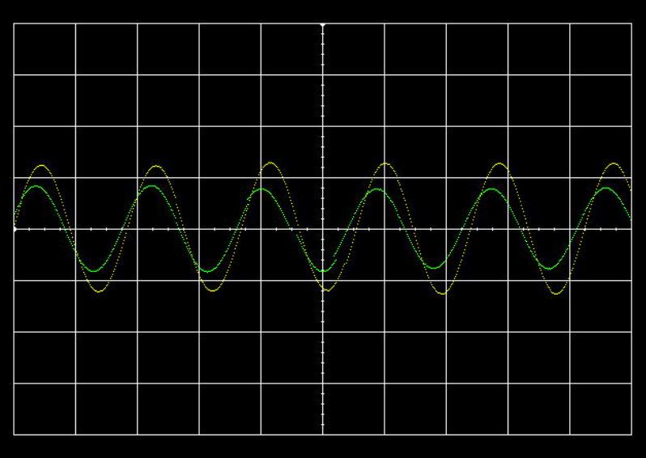

## Double check package file to contain all comp. declarations

##### Testbench For Flag Register
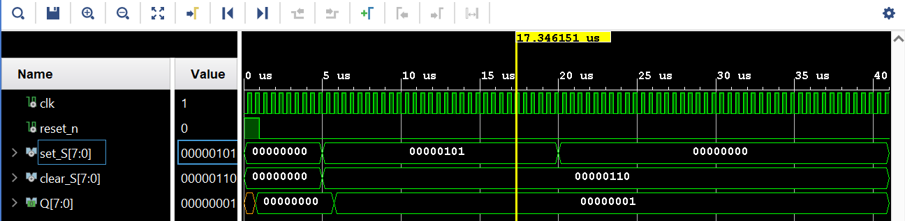

##### Finite State Machine Testbench
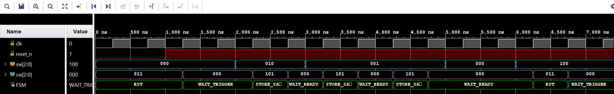

##### Datapath Testbench
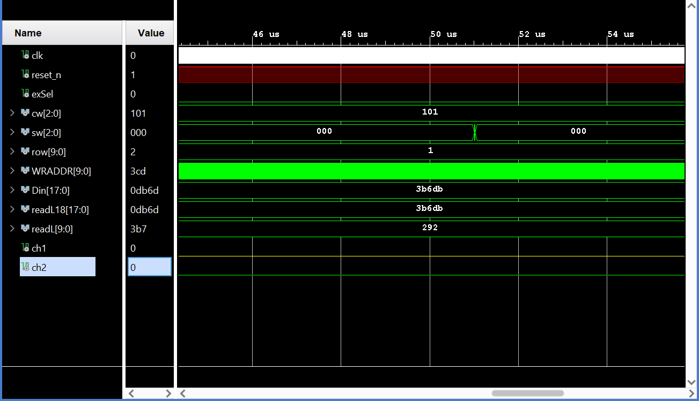

#### B-Level Functionality
Meet all the requirements of required functionality
Add a second channel (in green).
Move the cursors on the screen.

Most of this is in the figures in Required Functionality where we have a green ch2 signal. In the documentation there
is a VidGrid video of button/trigger use.

#### A-Level Functionality
Meet all the requirements of B-level functionality.
Use the trigger voltage marker to establish the actual trigger voltage used to capture the waveform. As the trigger 
is moved up and down, we should see the point at which the waveform intersects the left side of the screen change.
A-Level Functionality is shown in VidGrid as Required Functionality

### Software flow chart or algorithms
The control unit or Finite State Machine (FSM) has selected states that have to transition from one to the other
defined by the FSM designer. The lab has 4 states for its FSM where we start at Reset from CPU reset. the control
unit is determined by a 3 bit set word (sw) that transitions the states. The control word (cw) is the output of the 
FSM and sw that are sent to the datapath as shown in the architecture.

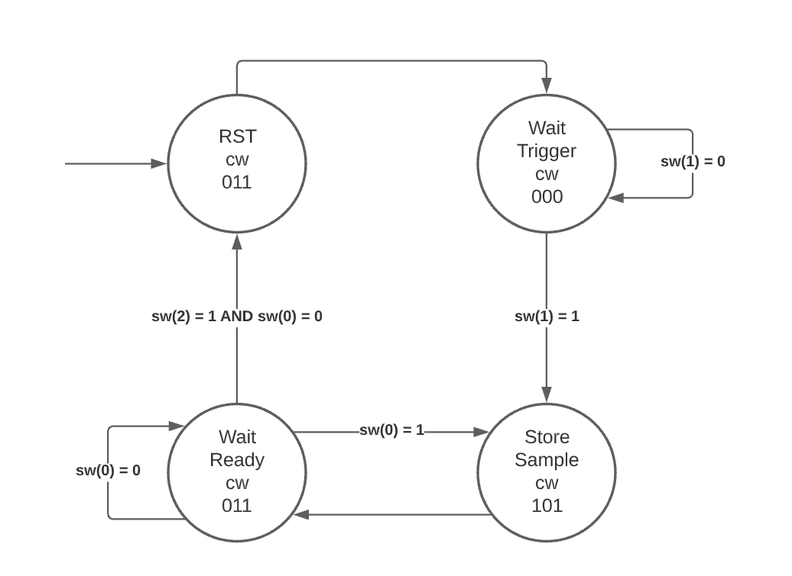

Below is the control word and set word table that determines the states and output of the FSM. Each word is 3 bits long
and can be set individually. However, the cw two lower bytes determines the counter and the higher bit controls write 
enable. 
The set word has its 3 bits controlled individually where they are also checked according to its respective state that 
it is in at the time. 

    -----------------------------------------------------------------------------
	--		The cw
	--		00			hold
	--		01			count up
	--		10			unused
	--		11			synch reset
	--     
	--      There is a cw(2) bit that is set 1 when BRAM write enable, else 0
	-----------------------------------------------------------------------------
	
	-----------------------------------------------------------------------------
	--		The sw
	--      001    ready from audio codec
	--		010    2 compare
	--		100    reaches 1023
	-----------------------------------------------------------------------------

### Hardware schematic
The Nexys Board will be used again in the lab to draw out waveforms on the scopeface. Below are the connections used in
the lab such as the general power, HDMI Out and USB Prog. Others like the buttons are used for the trigger and trigger 
reset. The Audio I/O is used for signal in for the scopeface and the output is if we want to listen to the waveform 
generated. And of course we have the CPU Reset in case we need to start back at the beginning.

The setup used in lab was a 3.5mm audio jack from a computer to the board for signal processing. The HDMI out from the 
board was an input to a HDMI to USB capture card that is sent into a computer and VLC Media Player to either screen 
record or take screenshots.
Lab 2 was programmed and generated by the same computer using a USB.

#### Connections
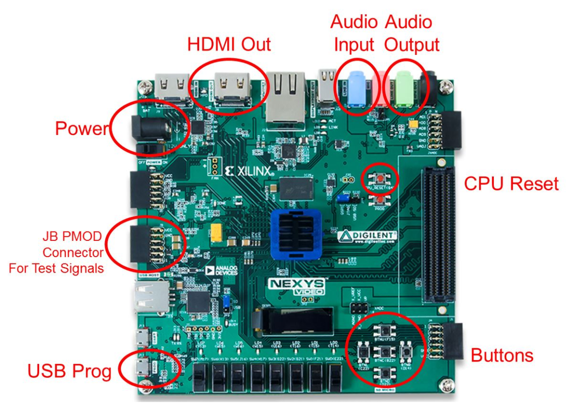

### Debugging
Debugging Gate Check 1 was simple but implementing it for the first time was different. All we had to do was to take lab 1
and to move it over to lab 2 where we put it inside the datapath with its original functionality. 
Gate Check 2 may have been the hardest part. Debugging was difficult and the concept of the BRAM connections was a lot to
go over. The BRAM itself was easy to set up the signals and get mux to select the counter. But if I can not see what the 
problem is or even know what the next step is, it is very difficult to debug. This is where found myself with TA Jacob Fox
and talking to Professor Falkinburg about my issues. I found out that the conversion was not difficult to change the scale
and shift the value up the scope. When it came to printing out the ch1 wave to the screen I had to comment out all of the 
codded process I had changed cw to "101" so that write enable and counting was being done. This produced the scrolling seen
earlier but I still couldnt figure out why my FSM didn't work. 
Eventually I found out my reset if statement was checking for an active high (not active low) reset and was never going into 
the FSM states. 
The last issue was in the triggervolt section. This is where we compared the previous bus value to the current and checked for
a rising edge essentially. I had found out that my unsidned value was not created correctly and that I needed to 
subtract -292 from the value. This, and some tweaking eventually got the trigger mark to work. Before It would attempt to 
find a trigger but would reset before it came close. 

### Testing methodology or results
Testing in lab 2 was done by either making a testbench for a certain entity or to generate the bitstream and figure out what
was not working. The generation of the bitstream was not as fast as simply making a testbench and runnin the simulation, but 
I would look aroun my code while the bitstream was being generatesd. I had created a testbench for both the control unit and
flag register but not the top level entity. The Lab2 entity was tested on the board using Lab2.vhd. Other testing such as 
checking the mux values and unsigned values were done in the datapath testbench where we could confirm that the in/out signals
were the same.

### Answers to Lab Questions
From 18 bits coming in from the audio codec to the scopeface. We had to ask ourselves how to get it to fit on the screen. 
With essentially 18 bits we took the top 10 bits of ths signal and changed it to unsigned and added 2^17. This gave us a 
positive integer that was from 0 to 1024. From there the signal was not centered on the x axis so by decreasig the value 
by -292 we had the signal centered. 

The other question we had to answer before making the FSM was what would our cw and sw be? 
I went with the standard shown in the datapath testbench and created the sw as it is in the flowchart shown earlier. 

Capability 
1. The horizontal axis represents time. There are 10 major divisions on the display; how long does each major division represent?
Since there are in total 800x535 pixels (420,000) we know that number divided by 60 FPS gives us 7000p/s and by the division line
being 600 pixels wide, 600p/7000p/s = 85.7ms divided by 10 divisions givs us 8.57ms/division.

2. Each major time division is split into 4 minor division, how long does each minor division represent?
Each hatch mark in those 10 divisions on the time axis represents 2.14ms/hatch mark.

3. Generate a sine wave that can be fully captured on your display (like the yellow channel in the image at the top of this web 
page). record its height in major and minor vertical divisions. Measure this same audio output using the break out audio cable 
or connect to the tip or ring and ground to the sleeve ground. Record the peak-to-peak voltage. Compute the number of volts 
in each major and minor vertical division.

4. Starting at address 0, how long does it take to fill the entire memory with audio samples (coming in at 48kHz)?
It would take 1024/48KHz = 21.3ms to fill up the BRAM.

5. How long does it take to completely draw the display once?
Roughly 1/60 = 16.7ms.

6. The question is likely relevant to Lab 3 - how long is the vsynch signal held low?
Since the screen is esentially 800 pixels wide, it would be 800x2 = 1,600pixels/7000pixels/s = 229ms.

### Observations and Conclusions
During this lab, we learned about how data is transfered with finite state machines. Using the control unit and the 
datapath, we are able to send out signals to the board to change states. The purpose of the lab was to use the in class
knowledge we have with the finite state machine and create two channels that would be sent through BRAM. In our case,
we were able to get ch1 to print out to the screen with the waveform constricted to the trigger volt and the rising 
edge of the waveform. As seen in the functionality this was able to be sent through BRAM and printed to the scopeface 
at a frequency of 440Hz. Ch2 was held at a frequency of 441Hz to create a frequency beat of 1Hz if not connected to the board.
What was noteworthy in the lab was how simple the FSM was in order to get the trigger to work correctly. Only 4 with some simple
states that reset, count, and wait. 
Ending this lab 2, we will use this for the later labs that have to deal with external signals. Applying the flag register now and 
setting up the external signals will be helpful for implementing a soft CPU. 

### Documentation
Help received by Professor Falkinburg and TA Jacob Fox in the main design and a big portion of Gate Check 2

Nexys Video FPGA Board Reference Manual
https://reference.digilentinc.com/_media/nexys-video/nexysvideo_rm.pdf

GATE CHECK 1  video: 
https://use.vg/l7Y7fA

Functionality: 
https://app.vidgrid.com/view/EcTE1JeRhwcV

