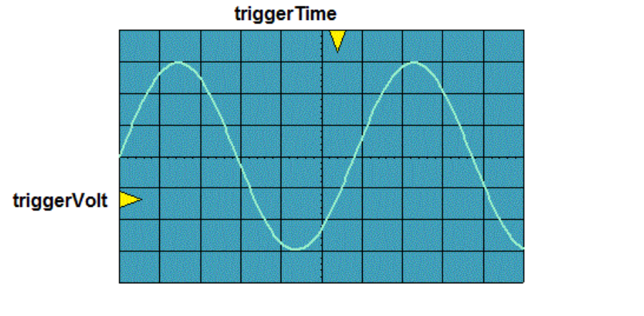
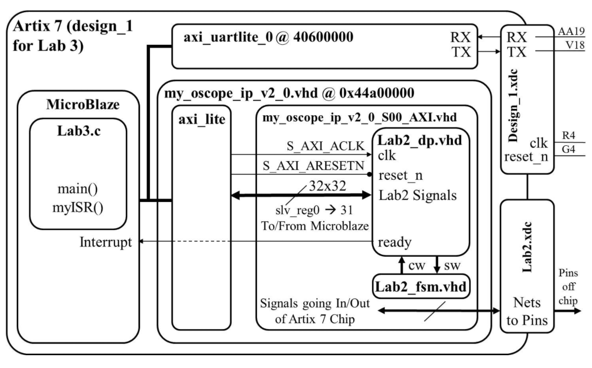
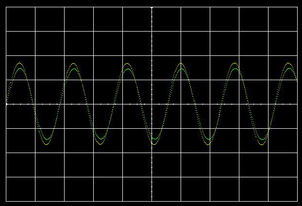
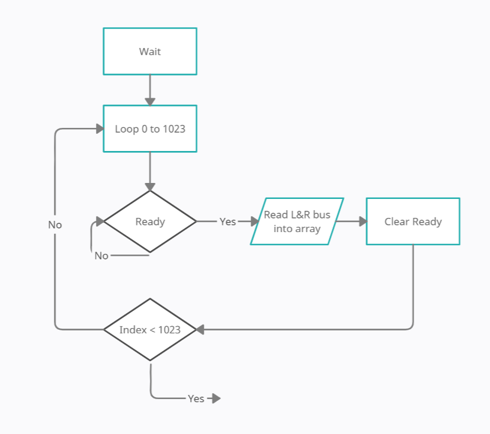
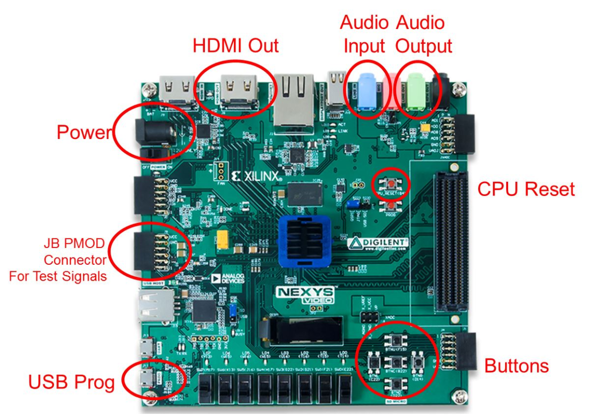
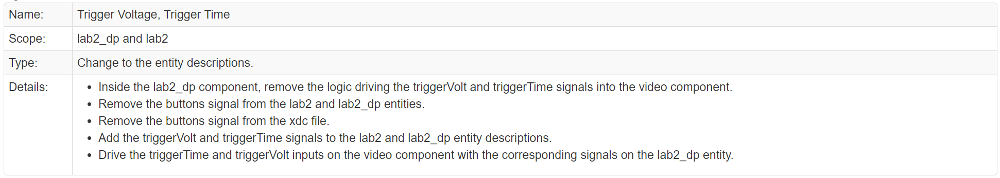
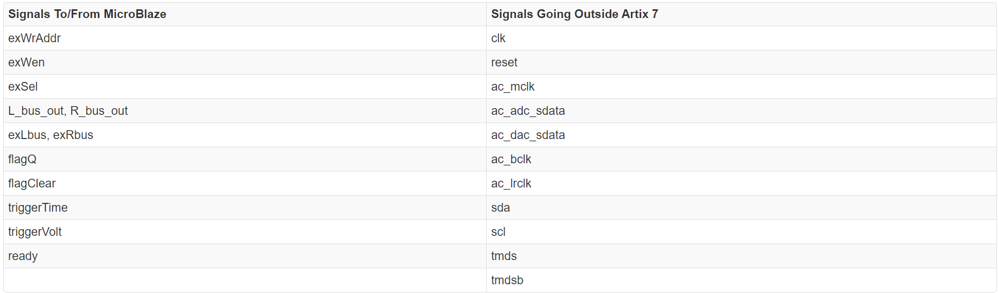
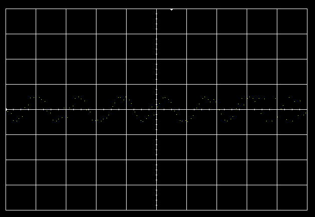
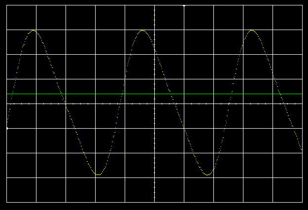

# Lab 3 - Software control of a datapath
## CSCE 436 - Advanced Embedded Systems
## By Brandon Ramos

## Table of Contents 
1. [Objectives or Purpose](#objectives-or-purpose)
2. [Preliminary Design](#preliminary-design)
 * [Code](#code)
3. [Software flow chart or algorithms](#software-flow-chart-or-algorithms)
 * [Pseudocode](#pseudocode)
4. [Hardware schematic](#hardware-schematic)
5. [Well-formatted code](#well-formatted-code)
6. [Debugging](#debugging)
7. [Testing methodology or results](#testing-methodology-or-results)
8. [Answers to Lab Questions](#answers-to-lab-questions)
9. [Observations and Conclusions](#observations-and-conclusions)
10. [Documentation](#documentation)
 
### Objectives or Purpose 
In Lab 3, we will integrate the video display controller developed in Lab 2 with the MicroBlaze processor built using the fabric of the Artix-7 FPGA. In the preceding lectures, we learned about  the Vivado and SDK tool chains, now it's time to put that knowledge to the test by building a software controlled datapath. Lab 2 revealed some shortcomings of our oscilloscope that this lab intends on correcting. Specifically, we will add:
- A horizontal trigger point
- The ability to enable and disable which channels are being displayed
- The ability to trigger off of channel 2
- The ability to change the slope direction of the trigger
The following figure shows required functionality - your program should allow the user to change the position of the triggerVolt and triggerTime indicators with the result that the waveform should be drawn so that the periodic waveform is increasing through that voltage at that time. The image below is what the scopeface should look like when triggering off of both triggerTime and triggerVolt.

##### ScopeFace for Lab 3 

In order to accomplish this, we will need to make some minor changes to the lab2 component, create a new piece of IP, and then program that IP using the MicroBlaze, as described in the block diagram below. We will walk through these steps below.

##### Block diagram of Lab 3 with Lab 2 Integrated IP

Note: In the program, we will provide a user menu (through the terminal), allowing the user to adjust the trigger voltage and trigger time. Therefore, we may want to check if the user has hit the key on the keyboard without having to actually read the key. For these cases, the following command will prove useful. Note that "uartRegAddr" is a constant, the address of the uart.

	'XUartLite_IsReceiveEmpty(uartRegAddr);'

### Preliminary design

#### Gate Check 1
By the beginning of lesson 22, we need to have all of the Lab 2 functionality implemented with the Microblaze. That is, we need to export Lab 2 design into the SDK and be able to achieve the same functionality as we did in Lab 2. Video of functionality is shown in Documentation for Gate Check 1. [^1] [review reference]()The image below is the O'Scope window after integration with Lab 3.

##### Lab 2 Integrated in Lab 3 O'Scope

#### Gate Check 2
By the beginning of lesson 23, we need to be able to send USART commands using Tera Term (or another terminal emulator) to the FPGA to adjust the trigger on the screen. The trigger on the screen should properly react to moving the trigger either up or down. Video of functionality of button can be seen
in the Documentation for Gate Check 2. [^2] [review reference]()

#### Required Functionality
In order to achieve required functionality, we will need to properly trigger the oscilloscope on channel 1 using a positive edge trigger. Control of this process is to be performed using the MicroBlaze. The 
main tasks of the MicroBlaze will include:

- Move audio samples into a pair of circular buffers. These circular buffers will be maintained in the address space of the MicroBlaze. That is, we should have two big arrays defined in your program. Use 
polling of the ready bit of the flag register.
- Examine the samples, looking for a trigger event.
- Fill the remaining sample slots in memory.
- Move the appropriate buffer values into the display memory of the oscilloscope (lab2) component.
- Provide a user menu (through the terminal) allowing the user to adjust the trigger voltage and trigger 
time.

#### B-level Functionality
- Achieve required functionality.
- Use the ready bit of the flag register to trigger an interrupt. The ISR should store the samples (left and right), look for a triggering event, and signal when the stored samples should be transfered to the 
BRAM in the oscilloscope component.

#### A-level Functionality
- Achieve B-level functionality.
- Ability to enable and disable channels to display
- Ability to trigger off channel 2
- Ability to change the slope direction of the trigger.

#### Using one bit from a vector to trigger an interrupt
In order to achieve A functionality, this assignment requires the programmer to use a single bit of Q (the std_logic_vector output from the flag register) as the interrupt signal. This may require the programmer to extract the one bit Q as a separate signal to connect to the MicroBlaze in the block design.

The video can be seen in the documentation as Functionality. [^4] [review reference]()
	
### Software flow chart or algorithms
- All the memory mapped hardware registers will have their names setup as #define's with a name ending in "Reg".
- Any register with bit fields will have the bit index setup as #define's with a name ending in "Bit".
- The flagQ and flagClear registers need to be at the same address.

Below is a flowchart of reading in data from the Left and Right bus using the ready signal. Note that the flowchart is reffering to an algorithm where the Interrupt Service Routine (ISR) is not being used. In this case the algorithm uses polling to grab data where it waits in essentially a while loop waiting for the ready signal to go high. For later functionality this is disgarded and a ISR is used instead. This way we can enter the ISR when the data is ready instead of slowing down the software further waiting 
for the ready signal.

##### Functionality flowchart showing algorithm withoug ISR (Interrupt Service Routine)

A good portion of the functionality i.e. Rising/Falling Edge trigger, Ch1/Ch2 trigger or Lab2 internal functionality can all be changed by using a u8 data type and changing the values to their respective "Boolean" values. For example, to trigger off of channel 1 we would need to enable a variable. From the variable we look at an if statement and send it off to the slave register to be read in the datapath. 

### Hardware schematic
With the exception of the following Engineering Change Orders (ECO) in the table below, the hardware developed in lab2 will be unchanged. For the following ECO, please refer to the high-level architecture in Lab 2.

The Nexys Board will be used again in the lab to draw out waveforms on the scopeface. Below are the connections used in the lab such as the general power, HDMI Out and USB Prog. Others like the buttons are disabled in Lab 3 by the ECO. The Audio I/O is used for signal in for the scopeface and the output is if we want to listen to the waveform generated.

The setup used in lab was a 3.5mm audio jack from a computer to the board for signal processing. The HDMI out from the board was an input to a HDMI to USB capture card that is sent into a computer and VLC Media Player to either screen record or take screenshots.

#### Connections

##### Engineering Change Orders (ECO) Table

The first step will be to create a component for the lab2 component in a Vivado repository. This will require the programmer to think about what signals are routed to the MicroBlaze and what signals are going outside the Artix 7 chip. The following table should help.

##### Lab 2 signals to port out to sofware and outside design
 

### Debugging
Gate Check 1 came with its own set of problems. Gate Check 1 used slave registers to push and pull data from the MicroBlaze to the datapath of lab 2. The issue that I had was deciding what needed to go on the read side of the slave register. Changing the slave registers was the heap of the debugging process, eventually using the lower 32 registers.

Gate Check 2 required the functionality of the slave registers to read data from the hardware. The problem that I was having with this gate check was the use of initial values to the read side of the registers. The debugging process included deleting the wrapper files in Vivado that were in the SDK and then rebuilding them and exporting it back to the SDK. Once I rebuilt the software and compiled, rumnning the software allowed for trigger manipulation with the "wasd" keys

Later in the lab before implementing the ISR, it was found that organized scattering of the waveform could be seen below in the picture. This is known to happen if the software is slow enough that it essentially skips the array index. Once the ISR is added to the software, this was seen to show better results and less scattering. A good idea was to use printf's whenever checking if the ISR was being used or if values were as expected. At one point the ISR was not loading and this caused the Left and Right bus arrays to be all zeros.Following the wire it was shown that there was an active low reset that was causing the flag register to be zero all the time. As soon as this was reversed, the ISR was working as expected.

Towards the end of the lab looking at the waveform. It was apparent that the software was not printing through all of the values in the bus array. On the Scopeface there was scattering pixels of a sine wave. This can be seen in the figure below. The image shows that the scopeface was printing out to the screen.

##### Pixels being printed to screen with spaces
 

Though this O'Scope is not bulletproof, it was interesting to see that even with a perfect array of values of the sine wave, it was not printing every index. In the software, I used a for loop to make sure everytime the index 'i' was being sent to the slave register. This included both the address and value to BRAM. After building this I was able to get my waveform to look as it did in previous labs.

The last problem I encountered occured during the process of getting A-level functionality. It seemed as if the Right bus was being printed out exactly as the Left bus was. Using Ctrl+F to find the instances where I used the Right ram. For the longest time looking at all the code in the software. Professor Falkinburg and I both were looking in the hardware to see if there was a possibility that the values were not correctly connected to the external L/R bus. Following the wires it seemed that the connections were in the right place, but when in the datapath there was one little mistake. VHDL is not a case sensitive language, there was one letter that was lowercased that I changed to make sure it couldn't cause any problems. While in the file for the datapath. I saw this line of code: 

	'Rbus_out <= STD_LOGIC_VECTOR(L_bus_unsigned(17 downto 2));'
	
This was the Rbus_out that sent the data from the Audio Codec to the external bus. The code was checking the Left unsigned bus and putting it into the Right channel, essentially duplicating the waveform. A simple L to R change allowed the right to properly be displayed. A good part of debugging in this lab was using printf. The printf is what showed what was being put into registers and onto the slave register. 

A noteworthy comment is that while you may trigger off channel 1 or 2, you must print the other channel on the screen. Otherwise in the figure below you will get a line for channel 2 accross the screen while printing channel 1

##### Printing Channel 1 but not Channel 2

### Testing methodology or results
The nice thing about building the bitstream and exporting it to the SDK, long waits for compilation is not an issue anymore. Just compile and run to change the triggerVolt and triggerTIme. Using the Lbus and Rbus we can fill in a buffer for the functionality checkpoint to bring in new data for a waveform to trigger with both trigger marks. Print statements helped out with checking values going inside and out of the bus. If a value was being incorrectly displayed, you could follow the value to see where it is being manipulated in the wrong way. Same with commenting out the code and checking if the bare bones work. This meant reading in the data and putting it right back into the slave register to get a wave output. From there I would uncomment code to find 
the broken code.

### Answers to Lab Questions
As there were no formal question to this Lab 3, other questions had to be ansered. One question that was brought up quickly was that the buttons were supposed to be removed but were not. They were allowed to stay on as long as they did not cause any trouble with Lab 3 but were eventually removed. This was for the sake of time, resources and complexity. They were more trouble than needed, although they were only needed for Lab 2.

Another question that was easier to answer was where to enable the interrupt after disableing it. Due to how Vivado [^3] [review reference]()ran, disabling interrupts inside the ISR was not an option. Instead, there was a funciton that did the data manipulation to get the trigger intersection and the two options for placement for the enable ISR was either before or after the funciton. It would be in real time if the enable interrupt was set before the data manipulation but would be eaiser to enable it after the function whereas the array would be the previous state. This meant that the L/R bus values would not be the most recent values contained withing the ISR. But this was okay since the software was not time sensitive for its application so to speak. 

### Observations and Conclusions
In this lab, we will integrate the video display controller developed in Lab 2 with the MicroBlaze processor built using the fabric of the Artix-7 FPGA. In this assignment, I was able to build my knowledge on how hardware can be controlled by software. During the lectures leading up to the lab, it was interesting to see software change the hardware to turn on LEDs. The lab taught me how slave registers could move data from the software such as changing extenal select and changing logic in hardware to implement the change. What I also found noteworthy was that VHDL is not case sensitive, however when writing bulk code it is in my best interest to not write similar variable names. This is where I found myself with my final bug in the code which is discussed in the Debugging section. Fortunately we were able to add:

- A horizontal trigger point 
- The ability to enable and disable which channels are being displayed 
- The ability to trigger off of channel 2 
- The ability to change the slope direction of the trigger The following figure shows required functionality 

In the last lab which is to implement a LUT (Look Up Table) to create a function generator, I believe that this gives me the attention to detail I will need to make the most out of Lab 4. Using software with hardware will most certainly go hand-in-hand with the final project whatever that may be.

### Documentation

Assistance with lab took place with:
	Professor Jeffery Falkinburg
	TA Jacob Fox

Conversed with student(s) Tate Anderson and Josh Bearden regarding workflow issues.

[^1]: Gate Check 1
https://youtu.be/BJFPydwz0VA

[^2]: Gate Check 2
https://youtu.be/Ce3uMPXEPSA

[^3]: Vivado by Xilinx
https://www.xilinx.com/products/design-tools/vivado.html

[^4]:
https://www.youtube.com/watch?v=Yx8FIaSY-FY
