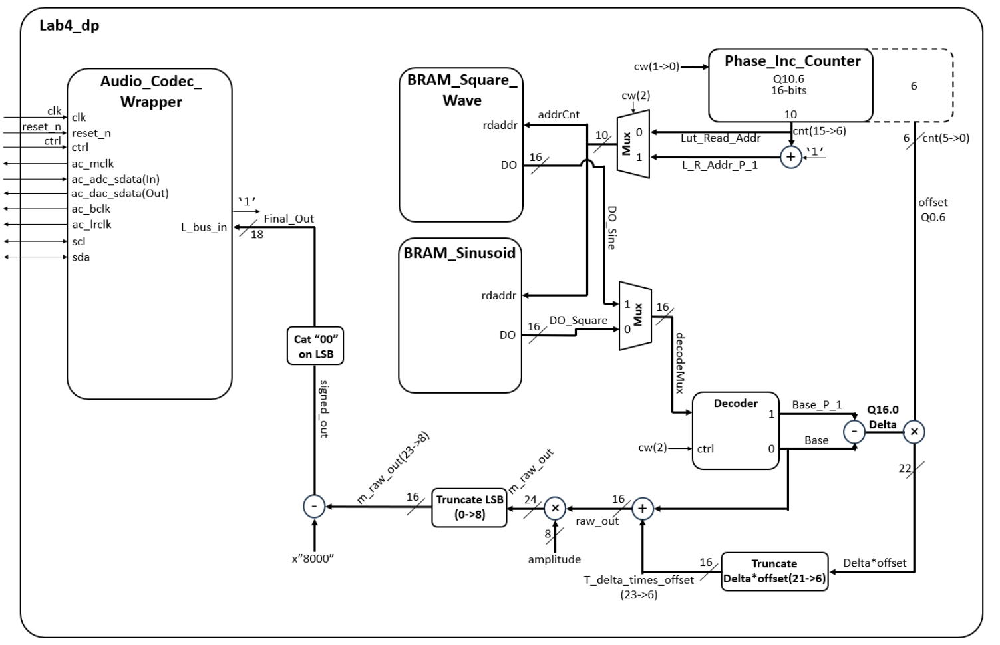
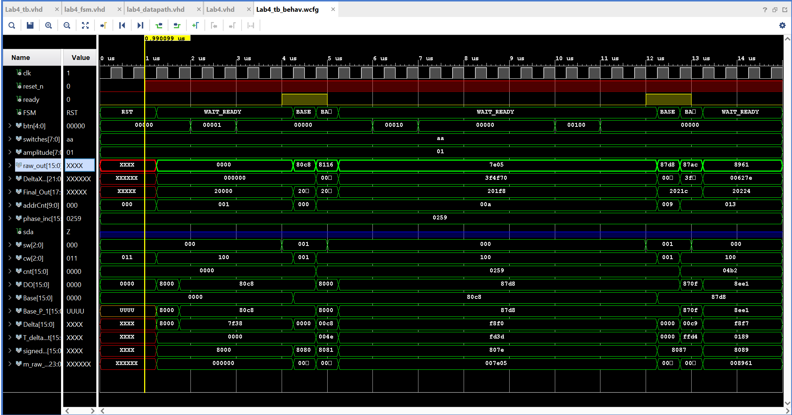
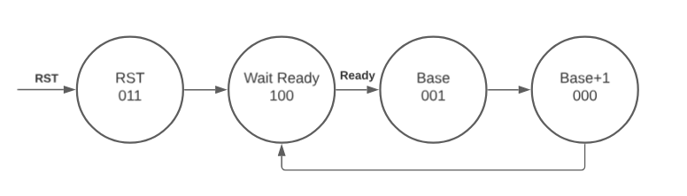
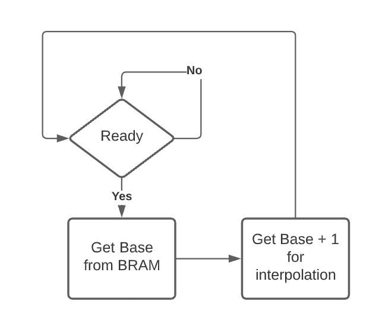
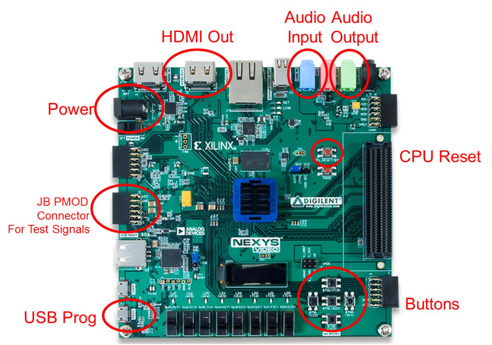
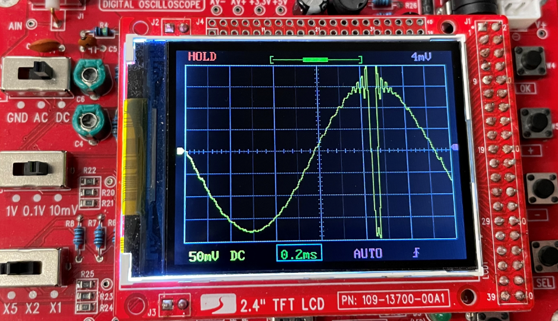
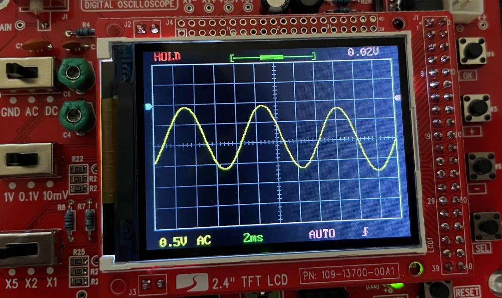
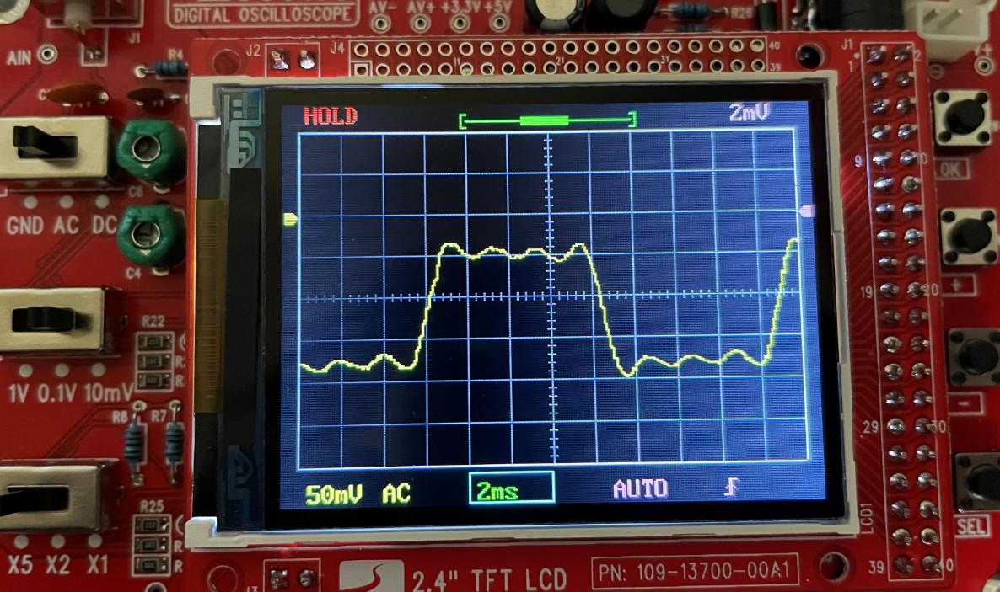

# Lab 4 - Function Generation
## University of Nebraska Lincoln: CSCE 436 - Advanced Embedded Systems
## By Brandon S. Ramos

## Table of Contents (not required but makes things easy to read)
1. [Objectives or Purpose](#objectives-or-purpose)
2. [Preliminary Design](#preliminary-design)
 * [Code](#code)
3. [Software flow chart or algorithms](#software-flow-chart-or-algorithms)
 * [Pseudocode](#pseudocode)
4. [Hardware schematic](#hardware-schematic)
5. [Well-formatted code](#well-formatted-code)
6. [Debugging](#debugging)
7. [Testing methodology or results](#testing-methodology-or-results)
8. [Answers to Lab Questions](#answers-to-lab-questions)
8. [Observations and Conclusions](#observations-and-conclusions)
9. [Documentation](#documentation)
 
### Objectives and Overview
The goal of this lab is to generate an audio waveform with a high degree of accuracy in both its period and frequency.

We are to use Direct Digital Synthesis to reproduce your audio waveform. We may choose any waveform so long as its not Piecewise Linear. A few interesting examples would be sinusoids, the sine function, exponentially damped sinusoids, or a waveform from a musical instrument (guitar, piano, or clarinet). It is our responsibility to get the samples for this waveform. Suggesting either deriving the waveform using a program like Python, using a spreadsheet, or digitizing the samples using Lab 3. Once we have the data, hardwired it into BRAM using "init" statements. Consulting the handout associated with [lesson 26]() for more details on how to accomplish this.

### Preliminary design
While we have the flexibility to design the waveform generator as we see fit, your system must meet the following requirements:
 1. Use an update rate of 48kHz
 2. At 440Hz, the LUT should be incremented by about 1 index.
 3. Be able to make between a 1Hz and 0.25Hz change in frequency.
 4. Be able to generate a full amplitude waveform.

#### Hardware
We will have to generate the block diagram for this assignment and present it at the beginning of the second lab session for review by the professor. The design must be segregated into a datapath and control unit. Your design must show the blocks in the datapath, the states in the FSM, the control word, and the status word joining the datapath and control unit.

#### Gate Check 1
At the end of the first lab session, we should have a completed hardware diagram drawn in paint or another image editing software that is readable and can be printed onto an 8.5x11 sheet of paper. Provide a digital copy of your schematic via Canvas at the end of class. This diagram must contain the following:
 - A border defining the top-level entity. Borders for each of the components instantiated within the top-level entity.
 - All components must be named in the upper left corner.
 - All signals entering and exiting components must have their port name defined just inside the border.
 - All signals outside the components must have their width defined as well as be labeled with their names.

##### Diagram of Lab4

#### Gate Check 2
At the end of the second lab period, we should have a working testbench. When simulating the design, have the testbench supply a mock ready signal in place of the ready signal generated the Audio_Codec_Wrapper (when put in a testbench, the Audio_Codec_Wrapper is not able to generate a ready signal without a lot of extra work).

When complete, expect the timing diagram to look like the image below and contain at least:
 - clk
 - reset
 - ready (simulated using CSA statements in testbench)
 - FSM state
 - BRAM address
 - Phase increment
 - BRAM data out
 - Amplitude coefficient (if aiming for B or A functionality)
 - Multiplied data out (if aiming for B or A functionality)
 - Slide switches
 - Button values
The simulation needs to simulate a button press (and release) to change the phase increment. After that is done, we need to show that the BRAM address is being incremented by your new phase increment 
value.

##### Here is Lab4 waveform

#### Required Functionality
Use the slide switches and push buttons to manipulate the phase angle and the amplitude of the waveform as follows:
 - Pressing the left button should decrease the frequency of the waveform by the amount set on the slide switches.
 - Pressing the right button should increase the frequency of the waveform by the amount set on the slide switches. The waveform should be played back through the Audio Codec interface. Remember to wait for the ready signal.

#### B-level Functionality
 - Pressing the up button should increase the amplitude of the waveform by the amount set on the slide switches.
 - Pressing the down button should decrease the amplitude of the waveform by the amount set on the slide switches.
 - Pressing the center button should toggle between 2-different waveforms.

#### A-level Functionality
Use the microBlaze to capture a keyboard input to manipulate the amplitude and frequency. The user will enter in an integer frequency and you are to produce a waveform with that frequency.

#### Bonus Functionality
Since Required functionality doesn't specifically require interpolation based on the two values in the LUT. If we modify your state machine to interpolate the values using the following equation developed DDS Lecture 26.

    -- Linearly_Interpolated_Value = Base + Offset*Delta;

When it came to the portion where we had to create the 1024 values in the sine wave and upload them to the BRAM, this was a time consuming process. Instead of doing it by typing or using excel, I decided to write a snippet of Java code to speed up the process. Below is a code snippet of what does the concatenation 
for the user. 

	public class main {
		public static void main(String[] args) {
			String[] array = new String[16];
			int count = 0;
			try{
				File file = new File("squareWave.txt");
				Scanner fileScan = new Scanner(file);
				for(int every16 = 0; every16 < 64; every16++) {
					for (int index = 0; index < 16; index++) {
						array[15 - index] = fileScan.nextLine();
					}
					System.out.print(String.format("INIT_%02X => x\"",count));
					count ++;

					for (int i = 0; i < 16; i++) {
						System.out.print(array[i]);
					}
					if(every16 < 63){
						System.out.println("\",");
					}else{
						System.out.println("\"");
					}
				}
			}catch(Exception e){
				System.out.println("File not found\n");
			}
		}
	}

	
### Software flow chart or algorithms
In the control unit, there is only one finite state machine (FSM) that controls the datapath. In this FSM there are four main states, three which we will look at.In Wait_Ready we are waiting for the ready signal coming from the audio codec. From there we go to our first address by increasing the address using the phase increment. Once we store the base in a register we choose the base + 1 to look for the next LUT value. Below can be shown the states.

##### Finite State Machine States

#### Pseudocode:
In another diagram shown, we have a flowchart of the states. This is where we can change the counter so that we can have different frequencies.

##### Counter Inc/Dec from FSM

### Hardware schematic
For the connections from the Artix-7 Board, we will be using some from previous labs but others will not be used. Connecting the board to power and programming it via USB are the two main connections. We will now be using the switches to change the phase and amplitude as a Q2.6 value. The buttons will do this phase shift increase/decrease (left and right buttons) and amplitude increase/decrease (up and down buttons) for the waveform. From the figure below, we will not be using the audio in or the HDMI out to be displayed. The only source coming out from the audio codec is the left bus out to an audio source.
##### Connections to and from the Nexys Board

### Debugging
Getting behind the concepts of lab 4 was the difficult part in a sense. Gate check 2 can be seen to have some troublesome getting it up and running. The main difficulty came from determining what Gate Check 1 had inside doing the math. To solve the issues shown in Gate Check 2 were to go through the math on paper (or a calculator) to make sure the values displayed were correct. This is how I got most of the signals to be displayed in the waveform. Coming to the bottom signals shown in the waveform in Gate Check 2 were the product, offsets and deltas used for interpolation. This is where I had my math and signals peered reviewd by Jacob Fox. 

As Projessor Falkinburg says, follow the wires. This helped when I was having problems at the end of the lab. I noticed that as soon as I tried to change the phase inc and amplitude of the signal, nothing audible could be heard to dictate a change. Of couse making sure the Q2.6 value was set to anything other than zero for the phase and 1 for the amplitude. I also recently added the other BRAM so that the audio codec could switch from using one waveform to another by a select signal to a mux. Testing this there was an audible difference in the two signals, this could only mean that the switches were not connected but the buttons were. Eventually following the wires to the top level Lab4.vhd file there seems to have a signal for the switches coming in but not digging deeper into the datapath file where it is needed the most. After connection of the switches, I was able to change phase and amplitude as designed.

After Lab 4 was complete, there was still one last problem I faced. My sine wave was spiking at the peak amplitudes of the waveform, this happened both for my sine and square wave. 

##### Spike at crest and trough of waveform

I had to go double check my signals to make sure it wasn't happening in the math portion of the datapath and when I was working with the signals it hit me. When working with the DDS spread sheet given in a previous lecture, I remember when I was trying to create my own square wave for the lab that there was something to look out for. If you were adding a bunch of sine functions together you had to make sure the value could fit inside a 4 digit hex value, otherwise you'd get an overflow. So I decided to divide all of my real sine values to get then all under the value of 1. From there I uploaded to the board and as shown below is my results.

##### Sine wave without spikes

Also, this was happening to my square wave which I had to be especially careful with the values. They would sometimes still spike even with values below 1. So making sure the values of the Real Sine were in range less than ".98" I uploaded them to the board and got the image below.
##### Square wave without spikes

### Testing methodology or results
Using the testbench at the beginning of the lab helped out to check signal processing. The testbench was also a required for the gate checks so this made students use the waveform instead of building the bitstream and wasting valuable time. Using this waveform, I double checked the values going into BRAM and the data coming out. I knew for an initial counter value of zero. I should get 0x8000 for the first LUT of the sine wave. From there I followed the signals throughout the math and made sure to use unsigned and signed values where needed. During the multiplication of signals, there has to be a wider bus to transfer 22 wide signal if the inputs are a Q0.6 and a Q16.0. 

### Answers to Lab Questions
There were not any formal questions to the lab, instead there is one that could be asked of us during the prelab. How to use interpolation to get a better sine wave. As shown in Gate Check 1 where we draw out the diagram for the lab, we noticed that there is a 16-bit counter where the upper 10 bits are for addressing BRAM. The lower 6-bits of the counter are for the interpolated value later. Once we get the LUT value coming out of BRAM into the D0 signal into a decoder, we can find the current LUT value and the next LUT value. This becomes our delta signal and will be multiplied by the offset which was that lower 6-bits from the counter. This is how the interpolated value goes through the hardware and eventually goes through to the left bus out from the audio codec.

### Observations and Conclusions
During this assignemnt, I was able to build my knowledge on creating a function generator from a LUT of a 1024 addressing sine wave. By using interpolation, I was also able to create a smoother sine wave that would use a base and base + 1 value for a delta and offset. I noticed that after the lab it was easier than initially thought to be. This mostly came from the fact that my Finite State Machine was only 4 different states including a reset state. This only did the incrementatio of the base and base+1. The button handling and switches were controlled inside of the datapath. A process was created to add or subtract a certain value from the ampitude or phase increment. The purpose of the assignment was to be able to update at 48kHz with a ready signal. This was used for the finite state machine using a set word. The next thing we wanted to do was to have a 440Hz sine wave when the LUT was being incremented by 1 index. This was done by setting the phase inc to have an initial value that was not zero and do make sure the fsm was working properly. We also needed be able to make a 1Hz change in frequency and able to generate a full amplitude in the waveform. All of these requrements were met in the this assignment. Sice this is the final lab of the course, this may be used in the final project where a project parter and I create pong. If time permits, we will add sound to the game by using lab 4 components.

### Documentation
Received help by Professor Falkinburg and TA Jacob Fox
Conversed with Josh Bearden

Lab 4 Functionality Video:
https://youtu.be/Gz4lHeH2UmM
